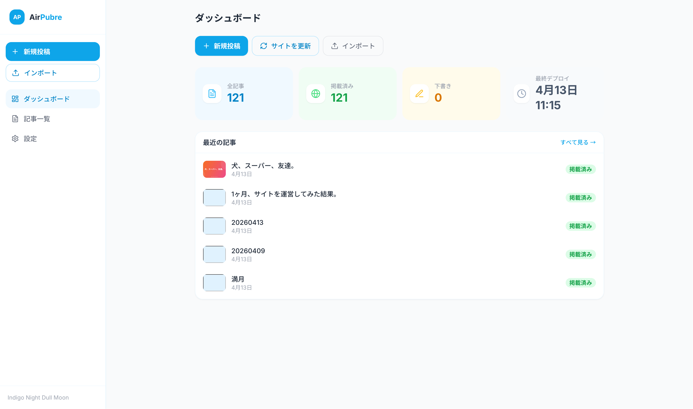
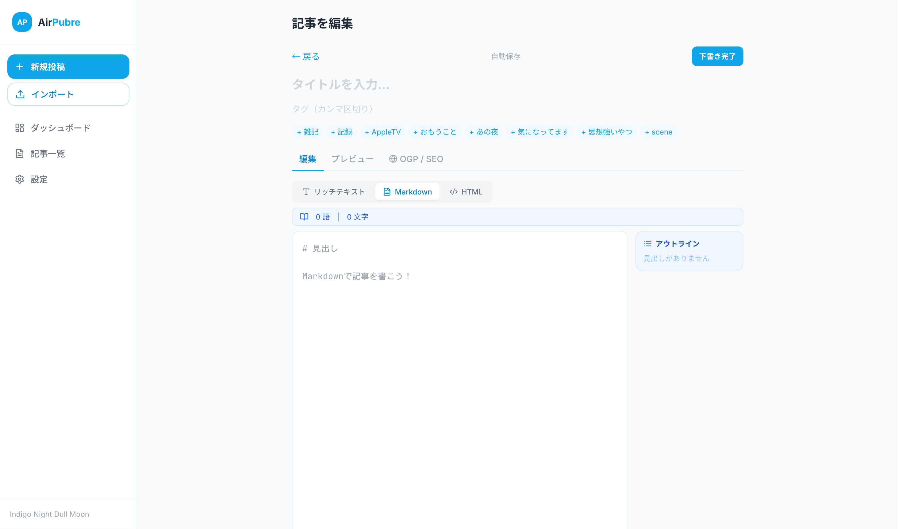
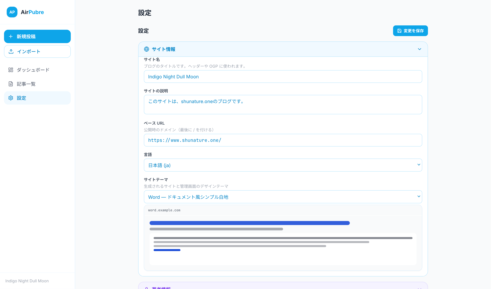

```
    _    _      ____        _
   / \  (_)_ __|  _ \ _   _| |__  _ __ ___
  / _ \ | | '__| |_) | | | | '_ \| '__/ _ \
 / ___ \| | |  |  __/| |_| | |_) | | |  __/
/_/   \_\_|_|  |_|    \__,_|_.__/|_|  \___|

          browser-native Markdown CMS
```

# AirPubre

**軽くて、速くて、あなただけのCMS。**
Lightweight Markdown CMS — write anywhere, deploy everywhere.

ブラウザだけで完結する個人向けMarkdown CMSです。サーバーもデータベースも必要ありません。下書きはIndexedDBに、ビルドはブラウザ内で、デプロイはGitHub / Vercel / ZIPから選べます。AI要約もTransformers.jsでローカル実行。パスキー（WebAuthn）でかんたんログイン。

A fully browser-based Markdown CMS for solo writers. No server, no database. Drafts live in IndexedDB, builds run in the browser, and you can deploy to GitHub / Vercel / ZIP. AI summarization runs locally via Transformers.js. Passkey (WebAuthn) login supported.

---

> [!NOTE] このリポジトリはアーカイブ済みです。

---

## 📸 Screenshots

| ダッシュボード | エディタ | 設定 |
|---|---|---|
|  |  |  |

## ✨ Features / 機能

| | |
|---|---|
| 📝 **Markdown + リッチテキスト** | `marked` + `DOMPurify` によるプレビュー、TipTapで切り替え可能なWYSIWYG |
| 💾 **ブラウザ完結** | IndexedDB (idb) + Service Worker でオフライン動作・PWAインストール対応 |
| 🚀 **3種類のデプロイ先** | GitHub Pages / Vercel / ZIP ダウンロード |
| 🧩 **ヘッドレスGitHubモード** | ビルドせず `.md` をそのままGitHubにpush。削除もtree APIで伝搬 |
| 🔄 **デバイス間同期** | GitHubをハブに自動pull + 競合解決モーダル（ローカル維持 / リモート採用） |
| 📱 **クロスデバイス設定同期** | AES-GCM暗号化した設定をサイトに同梱、同期パスフレーズで復号・インポート |
| 📥 **過去記事インポート** | md / zip / xml / GitHub URLクローンに対応 |
| 🏷 **タグサジェスト** | 既存タグを使用頻度順に提案、クリックで追加 |
| 🤖 **AI要約（ローカル）** | Transformers.js でAPIキー不要・ネット不要 |
| 🎨 **4テーマ** | WordPress / Word / Obsidian / Markdown — 管理画面UIにも反映 |
| 🖼 **サムネイル形式指定** | WebP / PNG / JPEG / そのままから選択可能 |
| 🔐 **マスターキー認証** | ひらがな単語リスト + PBKDF2 (200k rounds, SHA-256) |
| 🔑 **パスキー (WebAuthn)** | 生体認証・パスワードマネージャー経由でクロスデバイスログイン |
| 📋 **スマートデプロイリスト** | 変更ありの記事のみ表示、変更なしは折りたたみ |

---

## 🚀 Quick Start

```bash
git clone https://github.com/dreambgnw/AirPubre.git
cd AirPubre
npm install
npm run dev
```

Then open `http://localhost:5173` and follow the setup wizard.

初回アクセスでセットアップウィザードが立ち上がります。

### Build

```bash
npm run build   # → dist/
```

`dist/` をそのまま静的ホスティングに置けば動きます。

---

## 🏗 Tech Stack

- **Frontend**: React 18 + Vite + Tailwind CSS
- **Editor**: TipTap (WYSIWYG) / textarea (raw Markdown)
- **Markdown**: `marked` + `marked-highlight` + `DOMPurify`
- **Storage**: IndexedDB via `idb`
- **PWA**: `vite-plugin-pwa` (Workbox)
- **AI**: `@xenova/transformers` (Transformers.js)
- **Packaging**: `fflate` (ZIP生成)
- **Auth**: WebAuthn (Passkey) + PBKDF2-SHA256
- **Deploy Adapters**: GitHub REST API / Vercel API / ZIP / Headless GitHub

---

## 🗂 Project Structure

```
src/
├── components/
│   ├── AdminShell.jsx        # 管理画面のレイアウト
│   ├── Editor/               # エディタ・下書き一覧・デプロイ選択
│   ├── Setup/                # 初回セットアップウィザード
│   ├── Settings/             # 設定画面
│   └── Import/               # 過去記事インポート
├── lib/
│   ├── storage.js            # IndexedDB ラッパー
│   ├── passkey.js            # WebAuthn パスキー登録・認証
│   ├── crypto.js             # マスターキー/サブキー + AES-GCM 同期暗号化
│   ├── deploy/               # 各デプロイ先のアダプター
│   ├── githubImporter.js     # GitHubからの逆方向インポート
│   ├── headlessFrontmatter.js
│   └── theme.js              # テーマ適用ヘルパー
└── styles/
```

---

## 🧠 How It Works

1. **Setup** — マスターキー（ひらがな12語）を生成、PBKDF2で暗号化保管。パスキー登録もオプションで可能。GitHubトークン・リポジトリもウィザード内で設定可能
2. **Write** — IndexedDBに下書き保存。Markdown / リッチテキスト切り替え可。タグは使用頻度順にサジェスト
3. **Build** — ブラウザ内で `marked` → HTML化、テーマCSSを適用
4. **Deploy** — GitHub Pages / Vercel / ZIP / ヘッドレスGitHubから選択。`airpubre/sync.enc`（AES-GCM暗号化設定）を自動同梱
5. **Sync** — 起動時に自動pull、競合があればモーダルで解決。新デバイスではサイトURLと同期パスフレーズで設定をインポート
6. **Login** — パスキー（WebAuthn）/ サブキー / マスターキーの3段階認証

---

## 🗺 Roadmap

- [x] Setup wizard + マスターキー生成
- [x] Markdown / TipTap エディタ
- [x] 4種デプロイアダプター
- [x] PWA + オフライン対応
- [x] AI要約 (Transformers.js)
- [x] 過去記事インポート (md/zip/xml)
- [x] ヘッドレスGitHubモード
- [x] GitHub URLクローンインポート
- [x] 競合解決UI + 削除の伝搬
- [x] テーマを管理画面UIに反映
- [x] タグサジェスト（使用頻度順提案 + クリック追加）
- [x] サムネイル形式指定（WebP / PNG / JPEG / original）
- [x] セットアップウィザードに GitHub 認証情報ステップ追加
- [x] クロスデバイス設定同期（`airpubre/config.json`）
- [x] インポート時の既存記事フロントマター保持（date→updated、タグ保持）
- [x] 著者ページ URL のカスタム指定
- [x] rsync 廃止 → ZIP に統一
- [x] AES-GCM 暗号化クロスデバイス同期（同期パスフレーズ方式）
- [x] パスキー認証（WebAuthn — セットアップ/ログイン/設定管理）
- [x] デプロイリストのスマートフィルタ（変更ありのみ表示）
- [x] 自動保存の重複修正
- [-] エンタープライズ対応（共同編集・権限管理）— Issueベースで対応 <- No add-on

---

## 📜 License

MIT

## 🙏 Credits

Built by **Anthropic Claude with shunature(dreambgnw)**.

- Author: [Shun Tonegawa (shunature)](https://ffnet.work)
